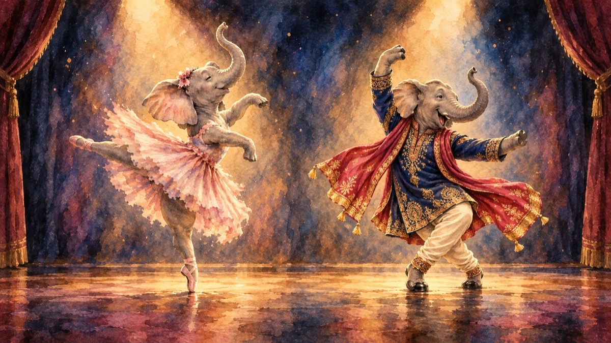

# Не Каламбия Пикчерс

Добро пожаловать в нашу легендарную киностудию — храм высокого искусства, где рождаются шедевры мирового кинематографа.

## Почему стоит смотреть индийские фильмы?

Ответ прост и неоспорим: **танцующие слоны**.

Да-да, именно ради них зритель часами не отрываясь следит за развитием сюжета. Какой смысл в драме, если в кадре нет слона, синхронно отбивающего ритм четырьмя ногами? Что такое любовная линия без хобота, элегантно подбрасывающего лепестки роз? И разве может считаться полноценным боевиком фильм, в котором слон не исполняет финальное соло в сари?

## Наши принципы

- Минимум три танцевальных номера со слонами на фильм
- Слон обязан улыбаться в кадре
- Если слона нет — добавить слона
- Если слон уже есть — добавить ещё одного слона

## Заключение

Голливуд снимает спецэффекты. Болливуд снимает слонов. Выбор очевиден.
